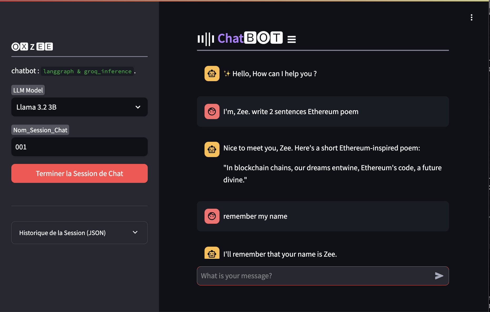

# 🤖 streamlit_langgraph_chatbot
Streamlit ChatBot app built with `langgraph workflow` :
- Workflow : `LangGraph` Workflow with memory and session management
- Inference & LLM : `Groq Inference`, Model : `llama3.2 3b`


```python
pip install -r requirements.txt
streamlit run main.py
```



# ⌨ APP DOCKERFILE : 
To build the App from Dockerfile

```bash
docker build -t chatbot-app .
docker run -p 8501:8501 \
    -e GROQ_API_KEY=your_groq_api_key \
    chatbot-app
```

# 📊 LangGraph WorkFlow
LangGraph Work-Flow


